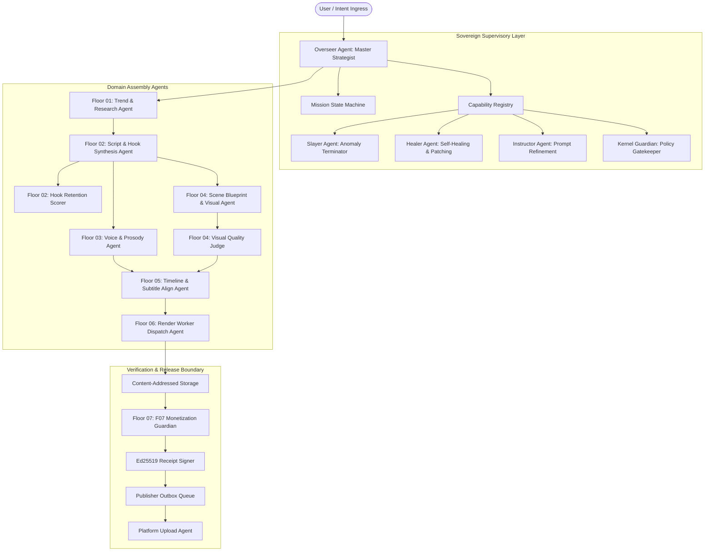
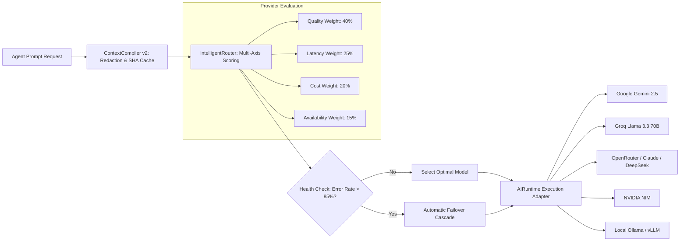
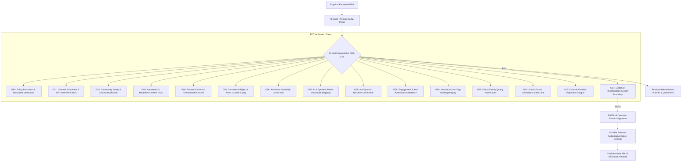

# ShortForge

> **Industrial-grade, autonomous AI video generation factory with deterministic control planes, multi-agent cognitive hierarchy, heterogeneous distributed GPU compute, and cryptographic release verification.**

<p align="center">
  <a href="https://github.com/Gokul7904231/ShortForge/actions/workflows/ci.yml"></a>
  
  
  
  
  
  
  
  <a href="LICENSE"></a>
</p>

---

## 1. Executive Summary & Engineering Philosophy

**ShortForge** is an open-source, enterprise-grade autonomous video generation factory engineered to synthesize high-retention 9:16 vertical video content (YouTube Shorts, Instagram Reels, TikTok) through a mathematically governed assembly line.

Unlike probabilistic "script-to-video" API wrappers that fail silently, hallucinate asset delivery, or produce repetitive demonetized spam, ShortForge operates as a stateful, deterministic manufacturing plant. It bridges a Next.js 16 supervisory kernel (**FactoryOS**), an autonomous **Heterogeneous Distributed Compute Fabric** (Kaggle T4, RunPod RTX 4090, Vast.ai RTX 3090, and Local FFmpeg engines), and an uncompromising **Cryptographic Release Boundary (F07 Monetization Guardian)**.

### Core Architectural Invariants

1. **`CLAIM <= EVIDENCE` (Eradication of Synthetic Success)**:
   No mission stage or publishing provider may assert task completion without supplying tangible, physically verifiable evidence. Missing file hashes, zero-byte artifacts, or simulated execution receipts trigger immediate fail-closed quarantine. Synthetic hash generation is strictly prohibited.
2. **Deterministic Governance over Generative Uncertainty**:
   LLMs generate creative hypotheses; deterministic code enforces boundaries. Video geometry (1080×1920), audio normalization (-14 LUFS), word-level caption synchronization, and YouTube Partner Program (YPP) compliance are hard physical invariants.
3. **Ponytail Token & Compute Economy**:
   Generative video synthesis is compute-intensive. ShortForge integrates a high-efficiency token economy consisting of `CallGate` cost guards, a 10-class `RetryClassifier`, and a bounded `ContextCompiler v2` that implements deterministic key ordering, contextual SHA-256 caching, and 11-pattern credential redaction.
4. **Cryptographic Release Authorization**:
   Content cannot be dispatched to YouTube or external networks without an active, non-replayed Ed25519-signed `ReleaseAuthorization` receipt issued by the F07 Guardian and tracked in a WAL-mode SQLite state machine.

---

## 2. System Architecture & Hierarchies

ShortForge implements a strictly stratified, 6-level architecture designed to isolate concerns, maintain auditability, and guarantee fault tolerance.

### 2.1 Complete System Hierarchy

```text
Level 0: INGRESS & USER BOUNDARY
         ├── Web UI Dashboard (Next.js 16 App Router, React 19, Tailwind v4, Lucide)
         ├── Public & Internal API Endpoints (109 Route Handlers)
         └── Auth & RBAC Boundary (Clerk + Firebase __session HMAC / Better-Auth)

Level 1: FACTORYOS SUPERVISORY KERNEL (Control Plane)
         ├── AutonomousFactoryController & MissionStateMachine
         ├── OverseerControlPlane (Task Decomposition, Context Bundling, Dynamic Floor Planning)
         ├── LeaseManager (Distributed Concurrency & Fencing Tokens)
         └── DurableEventBus & FactoryProjectionService (CQRS Projections & SSE Streaming)

Level 2: GOVERNANCE, SAFETY & COGNITIVE INTELLIGENCE
         ├── Kernel Guardian (Authoritative Policy & Structural Invariant Gate)
         ├── Typed Decision Fabric (Noul, Choice, Score Primitives with Epistemic Confidence)
         ├── Shadow-Mode Jev Intelligence (TypeSafeJevAdapter & DecisionLedger)
         └── Token Economy (CallGate, 10-Class RetryClassifier, ContextCompiler v2)

Level 3: ORCHESTRATION DAG (7-Floor Manufacturing Assembly Line)
         ├── Floor 01: Research & Trend Ingestion (Reddit, YouTube, Firecrawl, Tavily)
         ├── Floor 02: Narrative & Script Synthesis (Hook Clamps, Pacing, Structural Beats)
         ├── Floor 03: Audio & Voice Fabric (Edge-TTS, ElevenLabs, Audio Normalization)
         ├── Floor 04: Visual Realization & B-Roll (Flux, Pollinations, Dynamic Canvas)
         ├── Floor 05: Timeline Synthesis & Assembly (Whisper Alignment, Kinetic Subtitles)
         ├── Floor 06: Distributed Render Fabric (Worker Orchestration, Fencing & Leases)
         └── Floor 07: Release Integrity & Monetization Guardian (15 Independent Gates G00–G14)

Level 4: EXECUTION & DISTRIBUTED COMPUTE FABRIC
         ├── Autonomous Kaggle GPU Worker (Headless T4 Daemon with SSE Log Streaming)
         ├── RunPod Serverless / On-Demand Worker Pool (RTX 4090)
         ├── Vast.ai GPU Worker Instances (RTX 3090 / A4000)
         ├── Basic Warm Render Pool (FastAPI Worker daemon :8100 & :8080)
         └── Local FFmpeg Fallback Engine (Pillow, Edge-TTS, Faster-Whisper, Libx264)

Level 5: STORAGE & PERSISTENCE LAYER
         ├── Content-Addressed Storage (CAS) (Prefix-Sharded SHA-256 Immutable Storage)
         ├── Durable Authorization Store (SQLite release_authorizations.db, WAL Mode)
         ├── Publisher Outbox & Queue Store (SQLite queues.db, Monotonic Backoff)
         ├── Local SQLite Render Queue (better-sqlite3 data/shortfactory.db)
         ├── Firestore Database (User Quotas, Video Metadata, Channel Configs)
         ├── MongoDB 7.5 Cluster (FactoryOS Operational Collections & Mission Logs)
         └── Cloudinary Global Media CDN (Video Delivery & Streaming Optimization)
```

---

### 2.2 Cognitive Agent Hierarchy

ShortForge rejects monolithic LLM calls in favor of a specialized, multi-agent supervisory topology:



#### Sovereign Agent Roles & Responsibilities

| Role | Contract Type | Responsibility & Invariants |
| :--- | :--- | :--- |
| **Overseer** | Supervisory Controller | Deconstructs creative briefs into topological mission DAGs; monitors step-level timeouts and dynamically schedules floor execution. |
| **Slayer** | Remediation / Killer | Identifies unrecoverable anomalies (stalled workers, degraded video tracks, deadlocks) and terminates rogue execution leases cleanly. |
| **Healer** | Repair & Self-Healing | Executes localized recovery plans (regenerating failed audio frames, reprompting corrupted visual assets, falling back to alternative LLM providers). |
| **Instructor** | Meta-Prompt Optimizer | Dynamically adjusts system prompts based on historical performance metrics and F07 compliance feedback. |
| **ScriptAgent** | Creative Synthesizer | Crafts punchy, high-retention video scripts enforcing word-count clamping (130–160 words per 60s) and narrative arc dynamics. |
| **HookScoreAgent** | Predictive Evaluator | Evaluates the opening 3 seconds of generated scripts using cognitive hooks, curiosity gaps, and retention prediction models (Score > 0.85 required). |
| **SceneAgent** | Visual Blueprint Architect | Maps each script sentence to a precise visual scene blueprint, defining camera movements, color palettes, and B-roll search queries. |
| **SceneQualityAgent** | Perceptual Judge | Validates that synthesized background imagery adheres to 9:16 aspect ratios, visual aesthetics, and contrast rules for subtitle readability. |
| **UploadAgent** | Network Dispatcher | Safely dispatches release-approved videos to YouTube Data API v3 and Google Drive with resumable upload chunking and rollback protection. |

---

### 2.3 7-Floor Production Pipeline (The Assembly Line)

```text
┌─────────────────────────────────────────────────────────────────────────────────┐
│                           7-FLOOR ASSEMBLY LINE DAG                             │
└─────────────────────────────────────────────────────────────────────────────────┘
  [F01: Strategy & Trend Ingestion]
      │ • Query Reddit r/all, YouTube trending, and news via Tavily / Firecrawl
      │ • Extract viral semantic seeds and audience sentiment
      ▼
  [F02: Narrative & Script Synthesis]
      │ • ScriptAgent synthesizes 3-beat script: Hook (0-3s), Retain (3-45s), Payoff (45-60s)
      │ • HookScoreAgent scores hook effectiveness (Minimum 0.85 threshold)
      │ • Output: Validated JSON Script Manifest with word counts and scene markers
      ▼
  [F03: Audio & Voice Fabric]
      │ • High-fidelity Edge-TTS / ElevenLabs speech synthesis
      │ • EBU R128 audio normalization (-14 LUFS target, -1.0 dBFS true peak)
      │ • Ambient background music ducking (sidechain compression)
      ▼
  [F04: Visual Realization & Asset Engine]
      │ • Flux / Pollinations / SDXL generates 1080×1920 portrait imagery
      │ • Automatic safety filter & contrast optimization for mobile displays
      │ • Dynamic zoom/pan (Ken Burns effect) blueprint generation
      ▼
  [F05: Timeline Composition & Subtitle Synthesis]
      │ • Faster-Whisper word-level audio alignment (CTranslate2)
      │ • Kinetic subtitle layout generation (karaoke highlighting, glowing outlines)
      │ • Timeline JSON compilation binding video, audio, and subtitle tracks
      ▼
  [F06: Distributed Render Fabric]
      │ • Dispatch to Autonomous Kaggle T4, RunPod RTX 4090, or Local FFmpeg worker
      │ • Pillow renders 1080×1920 @ 30/60fps frames; FFmpeg muxes libx264 + AAC
      │ • Physical probe: FFprobe validates container geometry, codecs, and durations
      │ • Physical bytes hashed into Content-Addressed Storage (CAS)
      ▼
  [F07: YouTube Monetization & Compliance Guardian]
      │ • 15 Verification Gates (G00–G14) evaluate policy, copyright, and originality
      │ • Ed25519 detached cryptographic signature created on approved manifest
      │ • JIT capability token claimed; video dispatched to YouTube Data API v3
```

---

## 3. Complete Technology Stack Matrix

| Layer | Technology | Version | Purpose in ShortForge |
| :--- | :--- | :--- | :--- |
| **Core Framework** | **Next.js** | `16.0.0` | Full-stack supervisory control plane, API routing (109 endpoints), and dashboard. |
| **Runtime & Language** | **Node.js** | `>=20.x` | Control plane JavaScript/TypeScript runtime. |
| **Language System** | **TypeScript** | `5.x (Strict)` | Strict typing for FactoryOS kernel, state machines, and contract schemas. |
| **UI Library** | **React** | `19.0.0` | Modern reactive UI components with concurrent features and server components. |
| **Styling** | **Tailwind CSS** | `v4.0` | Modern design system, responsive 9:16 mobile canvas previews, and dark mode. |
| **Client State** | **Zustand** | `5.0.3` | Lightweight client state management for active missions and wizard flows. |
| **Server State** | **TanStack Query** | `5.66.0` | Asynchronous query caching, optimistic UI updates, and SSE hydration. |
| **Icons & Design** | **Lucide React** | `0.475.0` | Industrial icon system for factory dashboard and workflow visualization. |
| **Auth & Identity** | **Clerk** | `@clerk/nextjs` | Enterprise session management, multi-tenant RBAC, and fail-closed security. |
| **Auth & Tokens** | **Firebase Admin** | `13.1.0` | Cryptographic `__session` HMAC validation and service-to-service token minting. |
| **Secondary Auth** | **Better-Auth** | `1.1.20` | Headless, self-hosted session validation and API key authorization. |
| **Local Storage** | **better-sqlite3** | `12.0.0` | High-throughput WAL-mode SQLite database for render queue, keys, and outbox. |
| **Document DB** | **MongoDB** | `7.5.0` | Distributed persistence for FactoryOS mission logs, telemetry, and case history. |
| **NoSQL Database** | **Firestore** | Firebase SDK | Real-time user quotas, channel settings, and video catalog indexing. |
| **Media CDN** | **Cloudinary** | `2.5.1` | Global edge distribution, adaptive bitrate streaming, and thumbnail hosting. |
| **Validation** | **Zod** | `3.24.2` | Runtime schema validation for all API inputs, LLM responses, and manifests. |
| **AI LLM Routing** | **IntelligentRouter** | Custom | Multi-provider router scoring quality, latency, cost, and availability. |
| **Primary LLM** | **Google Gemini** | 2.5 Flash / Pro | Fast, cost-efficient scriptwriting, narrative synthesis, and reasoning. |
| **Inference Engine** | **Groq SDK** | Llama 3.3 70B | Ultra-low-latency real-time hook evaluation and creative iteration. |
| **Model Aggregator** | **OpenRouter** | API | Redundant failover gateway accessing Claude, Mistral, and DeepSeek. |
| **Enterprise AI** | **NVIDIA NIM** | API | Accelerated microservice inference for high-throughput metadata tagging. |
| **Local AI** | **Ollama / vLLM** | Local Daemon | Air-gapped, zero-cost local LLM inference for sovereign development. |
| **Image Synthesis** | **Flux / SDXL** | API / GPU | Ultra-high-resolution 9:16 image synthesis tailored for mobile storytelling. |
| **Free Visual Gen** | **Pollinations.ai** | Multi-model | Zero-credential fallback image and voice generation for development. |
| **Voice Synthesis** | **edge-tts** | Python 3.11 | High-speed, natural neural voice synthesis with granular prosody control. |
| **Premium Voice** | **ElevenLabs** | API | Expressive, emotive voice cloning for high-retention character narration. |
| **Audio Alignment** | **faster-whisper** | CTranslate2 | Word-level speech-to-text forced alignment for kinetic lyric video subtitles. |
| **Image Processing** | **Pillow (PIL)** | `>=10.0.0` | Python dynamic 1080×1920 canvas generation, text wrapping, and image layering. |
| **Video Processing** | **FFmpeg / FFprobe** | System Bin | Video encoding (H.264), audio normalization (EBU R128), and stream probing. |
| **Execution Plane** | **FastAPI** | `>=0.110.0` | High-throughput async Python worker service (:8080 main, :8100 warm pool). |
| **ASGI Server** | **Uvicorn** | `>=0.29.0` | High-performance asynchronous web server for rendering microservices. |
| **Compute Daemon** | **Kaggle API** | Python SDK | Automated headless Kaggle T4 notebook spinning, monitoring, and artifact retrieval. |
| **Cloud GPU** | **RunPod SDK** | GraphQL/REST | Serverless and on-demand RTX 4090 GPU execution instances. |
| **Cloud GPU** | **Vast.ai CLI** | REST API | Ultra-low-cost spot instance GPU rendering (RTX 3090 / RTX 4090). |
| **Publishing** | **YouTube Data API** | v3 | Resumable upload protocol, synthetic media disclosure, and title/tag tagging. |
| **Testing Engine** | **Vitest** | `3.0.5` | Monorepo test runner for FactoryOS kernel, evaluation tests, and gates. |
| **Code Hygiene** | **ESLint / Prettier** | Latest | Enforces clean-room coding standards and syntax rules across all planes. |

---

## 4. Multi-LLM Intelligent Router & Token Economy

ShortForge does not rely on a single LLM vendor. The Control Plane utilizes a dual-router architecture that guarantees 99.99% inference uptime at the lowest possible cost:



### 4.1 Four-Axis Model Scoring Engine
The `IntelligentRouter` calculates an composite score for every available provider:
$$\text{Score} = (w_q \cdot \text{Quality}) + (w_l \cdot \text{Latency}) + (w_c \cdot \text{Cost}) + (w_a \cdot \text{Availability})$$
- **Automatic Circuit Breaking**: If any provider experiences an error rate exceeding $0.85$ over the last 20 requests, it is quarantined for 180 seconds, and requests immediately fail over to the next best provider in the cascade.
- **Context Economy v2**:
  - **Deterministic Key Sorting**: Ensures identical prompt structures hit semantic LLM caches.
  - **Contextual SHA-256 Fingerprinting**: Eliminates redundant completions for recurring scene generation steps.
  - **11-Class Credential Redaction**: Automatically scrubs Google Cloud keys, Clerk secrets, Cloudinary credentials, and Bearer tokens before prompts leave the trust boundary.

---

## 5. Distributed Heterogeneous Compute Fabric

ShortForge renders high-definition vertical video without requiring a $5,000 local workstation. It abstracts compute into an on-demand, heterogeneous GPU fabric:

```text
┌─────────────────────────────────────────────────────────────────────────────────┐
│                    HETEROGENEOUS COMPUTE ROUTING MATRIX                         │
└─────────────────────────────────────────────────────────────────────────────────┘
                   ┌─────────────────────────────────────────┐
                   │    Job Manifest Dispatched from F05     │
                   └────────────────────┬────────────────────┘
                                        │
             ┌──────────────────────────┼──────────────────────────┐
             ▼                          ▼                          ▼
   [Autonomous Kaggle]           [RunPod RTX 4090]           [Local Engine]
    • Free NVIDIA T4 (16GB)       • $0.34/hr Dedicated       • Free Local CPU/GPU
    • Automated kernel push       • Sub-30s render speed     • Zero network latency
    • Polled via Kaggle API       • REST worker endpoint     • Fallback development
             │                          │                          │
             └──────────────────────────┼──────────────────────────┘
                                        │
                                        ▼
                   ┌─────────────────────────────────────────┐
                   │ 8-Level Provider Qualification Matrix   │
                   │ (Handshake ➔ Storage ➔ CAS Ingestion)   │
                   └─────────────────────────────────────────┘
```

### 5.1 Autonomous Kaggle T4 Pipeline
Through `kaggle_worker_bootstrap.py` and the `KaggleComputeProvider`, ShortForge can spin up an isolated, headless Kaggle GPU environment:
1. ShortForge packages the rendering engine, scripts, and fonts into a Kaggle kernel metadata payload.
2. The kernel launches an autonomous T4 GPU instance, loads the job manifest from Cloudinary, executes `create_short.py` using hardware-accelerated FFmpeg, and uploads the verified MP4 directly to Content-Addressed Storage.
3. Control Plane streams real-time stdout/stderr from Kaggle via SSE to the developer dashboard.

---

## 6. The F07 YouTube Monetization Guardian (15 Gates)

Floor 07 represents ShortForge's cryptographic release authority. To protect YouTube channels from strikes, demonetization, and algorithmic shadowbans, content must pass **15 sequential verification gates** before publication:



### The 15 Concrete Gates (G00–G14)

| Gate ID | Gate Name | Technical Evaluation Invariant |
| :--- | :--- | :--- |
| **G00** | **Policy Freshness** | Validates that official YouTube Policy snapshots in the local registry are $< 30$ days old. Fails closed if policy data is stale. |
| **G01** | **Channel Readiness** | Verifies target YouTube channel standing, active strike count ($0$), and YPP monetization eligibility criteria. |
| **G02** | **Community Guidelines** | Multi-layered contextual toxicity, hate-speech, self-harm, and graphic violence evaluation over script, visual, and audio. |
| **G03** | **Inauthentic Content** | Computes genome similarity against channel historical database; rejects scripts with semantic repetition score $> 0.82$. |
| **G04** | **Reused Content** | Proves substantive transformative value; verifies human or synthetic narrative commentary over underlying assets. |
| **G05** | **Commercial Rights** | Validates license receipts, expiration timestamps, and commercial broadcast rights for all audio tracks and visual assets. |
| **G06** | **Advertiser Suitability** | Evaluates compliance with advertiser-friendly content guidelines to prevent yellow-dollar demonetization flags. |
| **G07** | **Synthetic Media Disclosure** | Enforces YouTube's 2024 synthetic media policy; maps `containsSyntheticMedia=true` in `videos.insert` payloads. |
| **G08** | **Spam & Deception** | Validates logical coherence across the narrative arc; prevents deceptive thumbnails, false claims, and scam bait. |
| **G09** | **Fake Engagement** | Verifies internal behavioral attestations ensuring no artificial view generation or engagement pod interaction. |
| **G10** | **Packaging Integrity** | Audits title, description, and hashtags against clickbait limits; strictly blocks tag-stuffing in description fields. |
| **G11** | **Made for Kids** | Multi-factor audience classifier determining COPPA compliance and setting `selfDeclaredMadeForKids` appropriately. |
| **G12** | **Shorts Format Eligibility** | Validates exact 9:16 vertical geometry ($1080 \times 1920$), positive duration, and duration $\le 180$ seconds. |
| **G13** | **Creative Fatigue** | Evaluates channel-wide topic fatigue and pacing variance over a sliding 30-day publication window. |
| **G14** | **Evidence Reconciliation** | Final boundary check: verifies all preceding evidence references exist, hashes match physical CAS files, and signatures hold. |

---

## 7. Complete Repository Structure

```text
ShortForge/
├── .agents/                               # Antigravity agent customizations, skills, and rule sets
│   └── skills/                            # Animation, Apple design, and FactoryOS agent skills
├── .github/                               # CI/CD Workflows & Repository Automation
│   └── workflows/
│       ├── ci.yml                         # Automated TypeScript typecheck & Next.js production build
│       ├── factoryos-basic-render.yml     # On-demand GitHub Actions basic rendering runner
│       └── factoryos-render-worker.yml    # Continuous background worker dispatcher
├── apps/
│   └── web/                               # CONTROL PLANE: Next.js 16 Sovereign Application
│       ├── ai/                            # Multi-LLM Routing, Capability Registry & Token Economy
│       │   ├── economy/                   # CallGate, RetryClassifier & ContextCompiler v2
│       │   ├── providers/                 # Gemini, Groq, OpenRouter, NVIDIA, Local AI, Pollinations
│       │   ├── intelligent-router.ts      # 4-axis multi-provider scoring engine
│       │   └── runtime.ts                 # Standardized unified execution adapter
│       ├── agents/                        # Domain Assembly Agents (Script, Scene, Hook, Quiz, etc.)
│       ├── app/                           # Next.js App Router (109 Route Handlers + GUI)
│       │   ├── (auth)/                    # Authentication screens (Sign In, Sign Up, SSO)
│       │   ├── (os)/                      # Authenticated FactoryOS Operating System Desktop GUI
│       │   └── api/                       # RESTful Microservice Control Plane
│       │       ├── factory/               # Factory mission execution, state, and telemetry
│       │       ├── generate-video/        # Core pipeline ingestion & quota gate
│       │       ├── publish/               # YouTube & Google Drive publishing outbox
│       │       └── rendering/             # Worker claim, heartbeat, and callback endpoints
│       ├── components/                    # React 19 UI Component Library
│       │   ├── landing/                   # High-conversion product showcase pages
│       │   ├── factory/                   # Real-time mission DAG visualization & log streams
│       │   └── quick-generate/            # 4-step wizard for instant short-form video creation
│       ├── factoryos/                     # FACTORYOS SOVEREIGN KERNEL
│       │   ├── core/
│       │   │   ├── bridge/                # PythonFloorBridge (Node.js ↔ Python IPC)
│       │   │   ├── compute/               # ComputeProvider adapters (Kaggle, RunPod, Vast, Local)
│       │   │   ├── fabric/                # Heterogeneous worker protocol & CAS client
│       │   │   ├── intelligence/          # Typed Decision Fabric & TypeSafeJevAdapter
│       │   │   ├── overseer/              # Master mission controller & DAG scheduler
│       │   │   └── verification/          # F07 YouTube Monetization Guardian & 15 Gates
│       │   └── tests/                     # Vitest kernel test suites (100% passing)
│       ├── lib/                           # Shared utility libraries (Auth, DB, Quota, Storage)
│       └── publishing/                    # Resumable YouTube Data API v3 & Drive publishing engines
├── docs/                                  # CANONICAL DOCUMENTATION AUTHORITY
│   ├── architecture/                      # Current factual architecture & system topology
│   ├── factoryos/                         # Agent contracts, event definitions, and hierarchy
│   ├── compute/                           # Distributed rendering specs & provider qualifications
│   ├── intelligence/                      # Decision fabric & model routing specs
│   ├── security/                          # STRIDE threat model & capability boundaries
│   └── verification/                      # Traceability matrices, F07 proof reports, and audits
├── packages/                              # Monorepo Shared Libraries
│   └── factoryos-render/                  # Core Python rendering contracts and data classes
├── scripts/                               # Maintenance, Migration, & Repository Hygiene
│   ├── maintenance/                       # Database prune and cache flush scripts
│   └── verification/                      # verify-repository.js repository hygiene gate
├── services/
│   ├── pipeline/                          # Hexagonal Python Pipeline Floors (F01–F06)
│   │   ├── floor01_strategy/              # Trend discovery and audience resonance analysis
│   │   ├── floor02_scripting/             # High-retention script synthesis & hook clamping
│   │   ├── floor03_asset_realization/     # Visual prompt generation & asset resolution
│   │   ├── floor04_media_synthesis/       # TTS speech generation & image generation
│   │   ├── floor05_timeline_composition/  # Whisper word-level alignment & timeline JSON
│   │   ├── floor06_rendering/             # Worker dispatch & rendering execution
│   │   └── guardian/                      # Python-side watchdog & decision ledger
│   └── rendering-engine/                  # EXECUTION PLANE: High-Performance Rendering Workers
│       ├── basic_render_api.py            # Warm Basic render pool FastAPI daemon (:8100)
│       ├── basic_render_worker.py         # Isolated rendering worker with disk validation
│       ├── kaggle_worker_bootstrap.py     # Autonomous Kaggle T4 GPU runner & controller
│       ├── main.py                        # Standalone rendering worker API (:8080)
│       ├── worker_daemon.py               # Robust multi-threaded queue-polling worker
│       └── scripts/
│           └── create_short.py            # Authoritative Pillow + FFmpeg 1080×1920 video synthesizer
├── testing/                               # Canonical SituationGraph, EvidenceGraph, and visual diffs
├── commitlint.config.js                   # Git commit validation rule definitions
├── firebase.json                          # Firebase hosting and rule configuration
├── package.json                           # Root monorepo workspace configuration
└── LICENSE                                # MIT Open Source License
```

---

## 8. Configuration & Environment Variables Reference

ShortForge enforces strict separation of configuration across services.

### 8.1 Control Plane Environment (`apps/web/.env`)

| Variable | Required | Description | Example / Default |
| :--- | :--- | :--- | :--- |
| `NEXT_PUBLIC_APP_URL` | **Yes** | Canonical URL for the Control Plane | `http://localhost:3000` |
| `INTERNAL_API_SECRET_KEY` | **Yes** | Shared secret for worker-to-control-plane auth | `32-byte-hex-secret` |
| `CLERK_SECRET_KEY` | Optional | Clerk authentication backend secret key | `sk_live_...` |
| `NEXT_PUBLIC_CLERK_PUBLISHABLE_KEY` | Optional | Clerk public client key | `pk_live_...` |
| `FIREBASE_PROJECT_ID` | Optional | Firebase project ID for Firestore/Storage | `shortforge-prod` |
| `FIREBASE_CLIENT_EMAIL` | Optional | Firebase service account client email | `admin@shortforge.iam...` |
| `FIREBASE_PRIVATE_KEY` | Optional | Firebase service account private key | `"-----BEGIN KEY..."` |
| `MONGODB_URI` | Optional | MongoDB connection URI for FactoryOS | `mongodb://localhost:27017/factoryos` |
| `GEMINI_API_KEY` | Recommended | Google Gemini AI inference API key | `AIzaSy...` |
| `GROQ_API_KEY` | Recommended | Groq high-speed Llama inference API key | `gsk_...` |
| `OPENROUTER_API_KEY` | Optional | OpenRouter aggregator API key | `sk-or-v1-...` |
| `NVIDIA_API_KEY` | Optional | NVIDIA NIM inference key | `nvapi-...` |
| `ELEVENLABS_API_KEY` | Optional | ElevenLabs neural voice synthesis key | `xi-...` |
| `CLOUDINARY_CLOUD_NAME` | **Yes** | Cloudinary media CDN cloud name | `your-cloud-name` |
| `CLOUDINARY_API_KEY` | **Yes** | Cloudinary API access key | `1234567890` |
| `CLOUDINARY_API_SECRET` | **Yes** | Cloudinary secret access key | `your-api-secret` |
| `BASIC_RENDER_API_URL` | Optional | URL of the warm basic render worker pool | `http://localhost:8100` |
| `BASIC_RENDER_API_SECRET` | Optional | Shared bearer token for the basic pool | `your-basic-secret` |
| `KAGGLE_USERNAME` | Optional | Kaggle account username for GPU rendering | `your-kaggle-user` |
| `KAGGLE_KEY` | Optional | Kaggle API key for GPU kernel execution | `your-kaggle-key` |
| `RUNPOD_API_KEY` | Optional | RunPod API key for serverless GPU workers | `rpa_...` |
| `VAST_API_KEY` | Optional | Vast.ai API key for on-demand GPU workers | `vast_...` |

### 8.2 Rendering Engine Environment (`services/rendering-engine/.env`)

| Variable | Required | Description | Example / Default |
| :--- | :--- | :--- | :--- |
| `CONTROL_PLANE_URL` | **Yes** | Target URL of the ShortForge Control Plane | `http://localhost:3000` |
| `INTERNAL_API_SECRET_KEY` | **Yes** | Shared secret matching Control Plane | `32-byte-hex-secret` |
| `CLOUDINARY_CLOUD_NAME` | **Yes** | Cloudinary media CDN cloud name | `your-cloud-name` |
| `CLOUDINARY_API_KEY` | **Yes** | Cloudinary API access key | `1234567890` |
| `CLOUDINARY_API_SECRET` | **Yes** | Cloudinary secret access key | `your-api-secret` |
| `MAX_CONCURRENT_JOBS` | Optional | Max parallel rendering threads on this host | `2` |
| `PORT` | Optional | Listening port for FastAPI worker daemon | `8080` (or `8100`) |

---

## 9. Installation & Getting Started

### 9.1 Prerequisites

- **Node.js**: `v20.x` or higher
- **npm**: `v10.x` or higher
- **Python**: `v3.11` or higher
- **FFmpeg & FFprobe**: Must be installed and accessible globally on system `PATH`.
  - *Ubuntu/Debian*: `sudo apt-get update && sudo apt-get install -y ffmpeg`
  - *macOS*: `brew install ffmpeg`
  - *Windows*: `winget install Gyan.FFmpeg`

---

### 9.2 Quick Start (Local Development)

#### Step 1: Clone the Repository
```bash
git clone https://github.com/Gokul7904231/ShortForge.git
cd ShortForge
```

#### Step 2: Configure & Start the Control Plane
```bash
cd apps/web

# Install Node dependencies
npm install

# Copy example environment configuration
cp .env.example .env
# Edit .env with your Cloudinary and AI provider keys

# Start Next.js 16 development server
npm run dev
```
*The ShortForge Control Plane will be available at `http://localhost:3000`.*

#### Step 3: Configure & Launch the Local Rendering Engine
In a second terminal window:
```bash
cd services/rendering-engine

# Create and activate Python virtual environment
python -m venv venv

# On Linux/macOS:
source venv/bin/activate
# On Windows (PowerShell):
.\venv\Scripts\Activate.ps1

# Install Python requirements
pip install -r requirements.txt

# Start the warm Basic Render Pool (:8100)
python -m uvicorn basic_render_api:app --reload --port 8100
```

#### Step 4: Verify System Health
```bash
# Verify Control Plane health
curl http://localhost:3000/api/health

# Verify Basic Render API readiness
curl http://localhost:8100/ready
```

---

## 10. Autonomous Kaggle T4 GPU Deployment

For production rendering without local GPU hardware, spin up an autonomous Kaggle worker:

```bash
# 1. Set Kaggle credentials in apps/web/.env
KAGGLE_USERNAME="your-username"
KAGGLE_KEY="your-api-key"

# 2. Run the autonomous Kaggle render controller
cd services/rendering-engine
python kaggle_worker_bootstrap.py --action start --gpu-type T4
```
*The script automatically injects the kernel ID, establishes an outbound polling loop to ShortForge's render queue, renders jobs at 1080×1920 via hardware NVENC, and streams logs back via Server-Sent Events (SSE).*

---

## 11. Testing, Verification & Quality Assurance

ShortForge enforces a zero-defect standard before any code reaches production.

```bash
# 1. Strict FactoryOS TypeScript Typecheck
cd apps/web
npm run factoryos:typecheck

# 2. Run Full Vitest Suite (FactoryOS Kernel & Contracts)
npm run factoryos:test

# 3. Run Specific Subsystem Evaluations
npx vitest run factoryos/tests/token-economy.test.ts          # Token & Context economy
npx vitest run factoryos/tests/decision-fabric.test.ts        # Typed Decision Fabric
npx vitest run factoryos/tests/provider-qualification-v2.test.ts # Compute adapters
npx vitest run factoryos/tests/f07-guardian.test.ts          # 15 F07 Monetization Gates

# 4. Monorepo Hygiene & Claim <= Evidence Verification
cd ../..
node scripts/verification/verify-repository.js
```

---

## 12. Security & Threat Modeling

ShortForge operates under an active STRIDE threat model designed to defend against generative AI attack vectors:

- **SSRF & Boundary Hardening**: All media fetch URLs in `create_short.py` and `prepare_scene_bg` validate IP addresses against private network ranges (`10.0.0.0/8`, `172.16.0.0/12`, `192.168.0.0/16`, `127.0.0.0/8`) and reject cloud metadata IPs (`169.254.169.254`).
- **Timing-Safe Authentication**: Callback endpoints (`/api/rendering/callback`) and claim mechanisms verify execution tokens using constant-time comparisons (`crypto.timingSafeEqual`) to prevent timing side-channel attacks.
- **Fail-Closed Gatekeeper**: If any F07 gate cannot reach consensus or times out, publishing is unconditionally aborted (`overallOutcome = "BLOCKED"`).

To report security vulnerabilities, please email security@shortforge.dev or submit a private advisory on GitHub.

---

## 13. License

ShortForge is licensed under the **MIT License**. See the [LICENSE](LICENSE) file for details.

```text
Copyright (c) 2026 ShortForge Contributors
Permission is hereby granted, free of charge, to any person obtaining a copy
of this software and associated documentation files (the "Software"), to deal
in the Software without restriction, including without limitation the rights
to use, copy, modify, merge, publish, distribute, sublicense, and/or sell
copies of the Software, and to permit persons to whom the Software is
furnished to do so, subject to the following conditions:
...
```

---

<p align="center">
  <b>ShortForge</b> — Engineered with precision by AI Architects, LLM Engineers, and Distributed Systems Researchers.
</p>