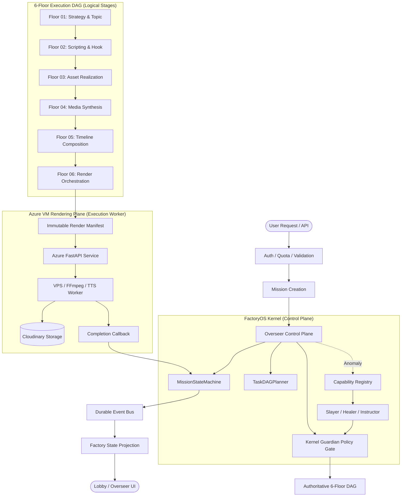

# SHORTFORGE / FACTORYOS — CANONICAL SYSTEM ARCHITECTURE

## 1. Executive Summary & Core Principle

ShortForge / FactoryOS is an industrial-grade, deterministic, and autonomous video generation assembly line.
The architecture enforces a strict invariant:

> **THERE MUST BE EXACTLY ONE AUTHORITATIVE PRODUCTION EXECUTION GRAPH PER JOB.**



---

## 2. Component Responsibility Matrix

| Component | Responsibility | Boundary Restrictions |
| :--- | :--- | :--- |
| **Overseer** | Mission lifecycle, DAG progress, capability selection on anomaly, global coordination | **NEVER** performs media processing (FFmpeg/Pillow/TTS). **NEVER** bypasses Guardian gates. |
| **MissionStateMachine** | Enforces atomic legal state transitions for missions and floor executions | Pure state machine logic; rejects invalid or out-of-order transitions. |
| **Kernel Guardian (TS)** | Safety policy gate, permission gate, risk evaluation (`LOW` to `CRITICAL`), audit logging | Gate authority. Does not execute worker tasks directly. |
| **Floor Compliance Validator (Python)** | Invariant verification and payload validation on the execution plane | Validates floor outputs; reports compliance certificates back to Kernel Guardian. Cannot override Kernel Guardian. |
| **Floor DAG (Floors 01–06)** | Logical stages of production (Strategy → Script → Assets → Media → Timeline → Render) | Floors update only their execution state/output; never mutate global configuration or user accounts. |
| **Capability Registry** | Catalog of specialized diagnostic, repair, and validation capabilities | Maps typed anomalies to Slayers, Healers, and Instructor. |
| **Slayers** | Diagnostic and root-cause analysis agents (e.g., quality drop, asset mismatch) | Produce structured findings; never mutate global state directly without Guardian approval. |
| **Healers** | Idempotent recovery and reconciliation agents (e.g., missing artifact, re-dispatch) | Must acquire recovery locks, respect idempotency keys, bounded retries. |
| **Instructor** | Bounded schema validator and structural output repairer | Non-agentic, deterministic contract enforcer for LLM JSON outputs. |
| **DurableEventBus** | State-change event stream with consumer groups, DLQ, and replay | **NOT** the database. Authoritative current state lives in Firestore / DB. |
| **FactoryProjectionService** | Read model aggregator for UI and SSE streams | Observability projection only; not the source of business truth. |
| **Azure Rendering Plane** | Authoritative media rendering worker (FFmpeg, edge-tts, ImageMagick) | Heavy worker plane. Dispatched with signed execution token. |

---

## 3. The 6-Floor Authoritative DAG

```text
1. FLOOR 01 — STRATEGY & INTELLIGENCE
   • Input: Topic / User Prompt / Niche / Platform Config
   • Processing: Topic intelligence, trend analysis, audience target, curriculum mapping
   • Output: Validated Strategy & Topic Payload

2. FLOOR 02 — SCRIPTING & NARRATIVE
   • Input: Strategy Payload
   • Processing: Hook generation, scene-by-scene script, audio cues, timing budget
   • Output: Validated Script & Scene Manifest

3. FLOOR 03 — ASSET REALIZATION
   • Input: Script Manifest
   • Processing: Visual prompt crafting, style consistency check, asset candidate resolution
   • Output: Asset Blueprint & Prompt Manifest

4. FLOOR 04 — MEDIA SYNTHESIS
   • Input: Asset Blueprint & Script
   • Processing: Voice generation / TTS synthesis, image generation, audio timing alignment
   • Output: Media Manifest (audio tracks, visuals, timing markers)

5. FLOOR 05 — TIMELINE COMPOSITION
   • Input: Media Manifest & Scene Rules
   • Processing: Audio-visual synchronization, caption positioning, transitions, scene pacing
   • Output: Authoritative Render Manifest (scenes, durations, layers, effects)

6. FLOOR 06 — RENDER ORCHESTRATION
   • Input: Render Manifest
   • Processing: Manifest validation, Guardian safety gate, dispatch to Azure VM Plane
   • Output: Dispatched Job & Final Rendered Video URL (Cloudinary)
```

---

## 4. Production Rendering Guard & Failure Model

1. **Azure Render Plane Authority**: All production tiers (`BASIC`, `ADMIN`, `OWNER`, `SUPERADMIN`) dispatch heavy rendering to `BASIC_RENDER_API_URL`.
2. **Strict Production Guard**:
   - **NO** local FFmpeg fallback in production.
   - **NO** SceneRenderPool in production.
   - **NO** in-process rendering inside Next.js.
   - If Azure rendering plane is unreachable, the system **FAILS CLOSED** with state `FAILED` and error `RENDER_SERVICE_UNAVAILABLE`.
