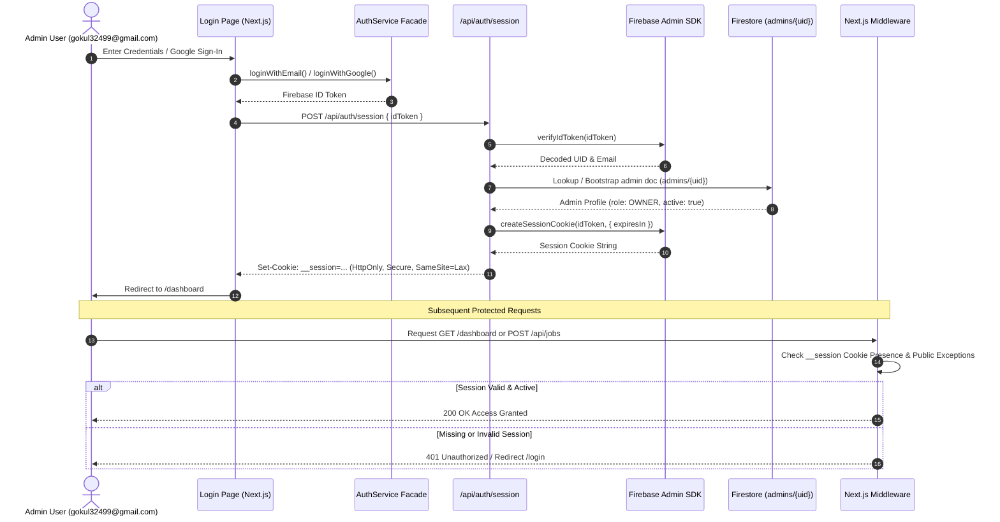

# 🔐 Authentication & Authorization Architecture — FactoryOS v1

Welcome to the production-grade authentication and authorization documentation for **FactoryOS**.

---

## 1. 🏗️ Architectural Overview

FactoryOS uses a defense-in-depth security model built upon **Firebase Authentication** (Email/Password & Google OAuth), **Firebase Admin SDK**, **HTTP-Only Session Cookies**, **Next.js Middleware**, and **Firestore Role-Based Access Control (RBAC)**.



---

## 2. 👥 Firestore RBAC Admin Model

Admin profiles are stored in Firestore under the `admins` collection using the **Firebase UID** as document ID.

Collection: `admins`  
Document ID: `<firebase_uid>`

```json
{
  "uid": "1Lg3iHEJqXgZFu1TzBr2zawJ4sK6gnkj9",
  "email": "gokul32499@gmail.com",
  "role": "OWNER",
  "active": true,
  "disabled": false,
  "name": "Gokul (Owner)",
  "createdAt": "2026-08-08T10:42:00.000Z",
  "updatedAt": "2026-08-08T10:42:00.000Z",
  "lastLogin": "2026-08-08T10:44:00.000Z"
}
```

### Role Matrix & Permissions
- **`OWNER`**: Complete access, admin role management, system-wide pipeline execution.
- **`ADMIN`**: Create & cancel production jobs, manage content engines, view analytics.
- **`EDITOR`**: Draft scripts & quizzes, view job execution histories.
- **`VIEWER`**: Read-only access to published videos & telemetry metrics.

---

## 3. 📝 Authentication Audit Trail (`auth_audit`)

Every authentication event is recorded in Firestore under `auth_audit` for enterprise traceability:

```json
{
  "id": "audit_1786164000_a1b2c3d",
  "eventType": "LOGIN_SUCCESS",
  "uid": "1Lg3iHEJqXgZFu1TzBr2zawJ4sK6gnkj9",
  "email": "gokul32499@gmail.com",
  "role": "OWNER",
  "ipAddress": "127.0.0.1",
  "userAgent": "Mozilla/5.0 ...",
  "timestamp": "2026-08-08T10:44:00.000Z"
}
```

Logged Events: `LOGIN_SUCCESS`, `LOGIN_FAILURE`, `GOOGLE_LOGIN`, `LOGOUT`, `PASSWORD_RESET`, `ROLE_CHANGE`, `SESSION_REVOKED`, `ACCOUNT_DISABLED`.

---

## 4. 🛡️ Middleware Security Policies

- **Public Paths**: `/`, `/login`, `/api/published-video`, `/api/health`, `/favicon.ico`, `/_next`, `/public`.
- **Protected Paths**: `/dashboard/*`, `/factory/*`, `/media/*`, `/engines/*`, `/publishing/*`, `/api/*`.
- **Session Cookie**: `__session` (HTTP-Only, Secure in Production, SameSite=Lax).
- **Service-to-Service Auth**: Internal background workers authenticate using `Authorization: Bearer <INTERNAL_API_SECRET_KEY>`.
